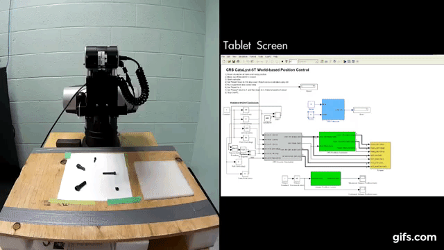

# Bolt_Sorting_Robot_CRS

An application of the Computer vision toolbox on MATLAB to capture, segment, locate, grab and sort objects using the CRS Catalyst-5 Manipulator with the QUARC library as an interface.

